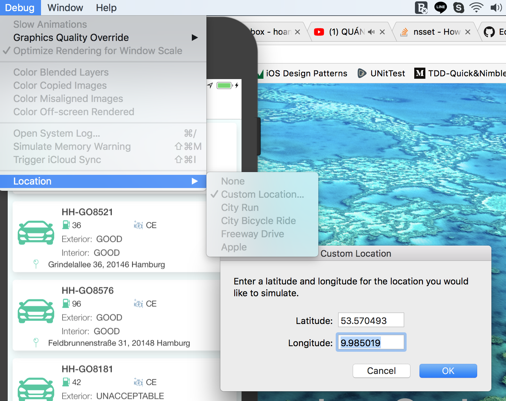
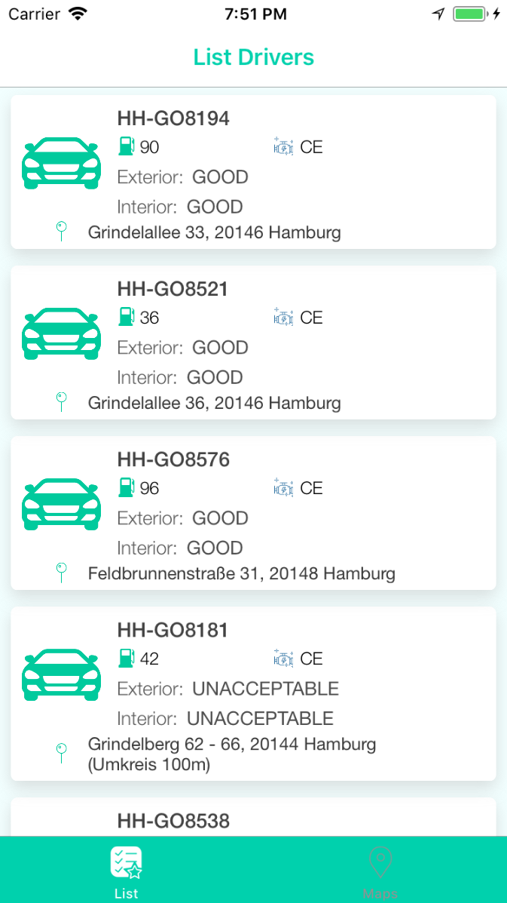
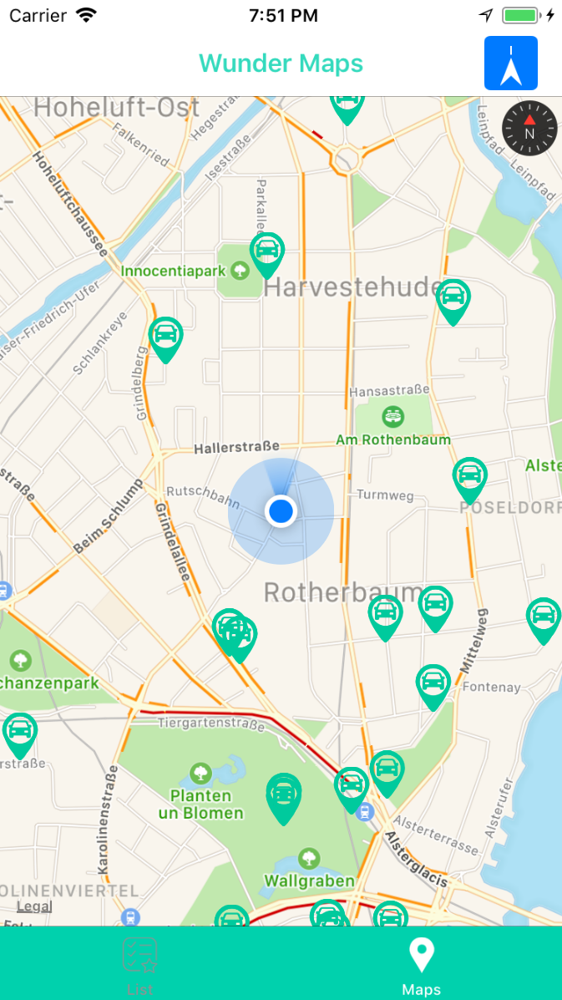

# WunderDrive 

### We are going to create a simple app to get list cars sepalet in two sections (TableView and Maps). It has sort by nearest of user location, lazy loading paging on list cars.

#### Please make sure that you're testing this app by real device, otherwise you must set default location to (53.570493, 9.985019)

  

 How to set default location for Simulator 

## New Change:
 - Now I changed to use MVVM-C without RxSwift.
 - Refactor 'CT_RESTAPI' to use only Alamofire and Coable.
 - Remove all unused files and use less frameworks as possible.

## Old Technical notes: 
 - Swift version 4.0
 - Xcode 9.2
 - MVVM pattern and reactive programming (RxSwift)
 - My Networking library 'CT_RESTAPI' (Coable Swift 4 or ObjectMapper)
 - Support sort list drivers nearest user's current location or centerLocation of map when we dragging.
 - Including UnitTests, Mocking for SearchDriversServiece
 - Including UITests for Wunder.
 - There is no need to install Pods (I commited all already)

### Thanks okhanokbay for MapViewPlus.

### Images:

  

 Movie results 

  

 Suggestions list 

 
